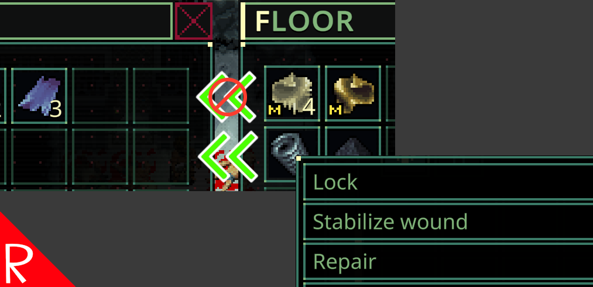

# I Don't Want That!  (Prevent Item Transfer)

Allows the user to mark items so they are not automatically transferred on the corpse recycle or take all commands.

When on mission, press F9 when hovering over an item to add or remove it to the blacklist.  Press F12 to clear out the blacklist.

The keys are configurable.

The game's normal Ctrl + Click and drag and drop not affected.

# Polish

There are a couple of items to be addressed in the next update:

* The "modified" icon (M) is used to indicate if something is blacklisted or not. 
This visually conflicts with anything that is found that is actually modified.
I don't know if it's even possible to find a modified item in the field.  This is just a placeholder.
* Sometimes the M icon isn't refreshed when marking items and then moving them.  The functionality works, but the UI is not updated.  Closing the inventory and opening it back up will display the correct marks.

# Configuration

The configuration file will be created on the first game run and can be found at `%AppData%\..\LocalLow\Magnum Scriptum Ltd\Quasimorph\QM_LockItemTransfer\config.json`.

|Name|Default|Description|
|--|--|--|
|LockItemKey|F9|The key to add or remove an item from the blacklist|
|ClearItemListKey|F12|The key to clear out the blacklist|

# Support
If you enjoy my mods and want to buy me a coffee, check out my [Ko-Fi](https://ko-fi.com/nbkredspy71915) page.
Thanks!

# Source Code
Source code is available on GitHub at https://github.com/NBKRedSpy/QM_LockItemTransfer

# Change Log

## 1.1.1
* Fix for mod crashing for new users due to the config folder not being created.  Thank you to TheGentlingCone for reporting this.

## 1.1.0
* Fixed Rules not filtering items when an action automatically unloads a weapon or an item is directly disassembled.  

# Credits

[Denied icons created by Alfredo Creates - Flaticon](https://www.flaticon.com/free-icons/denied")

[Move icons created by Shashank Singh - Flaticon](https://www.flaticon.com/free-icons/move")

